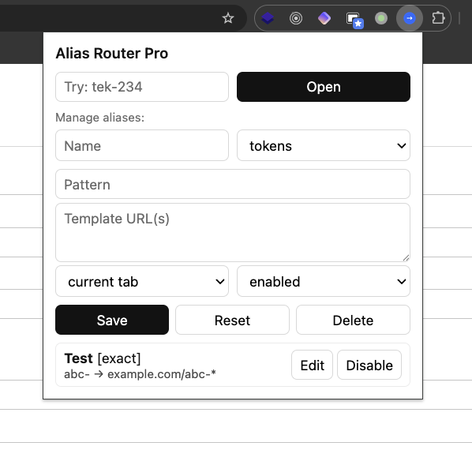
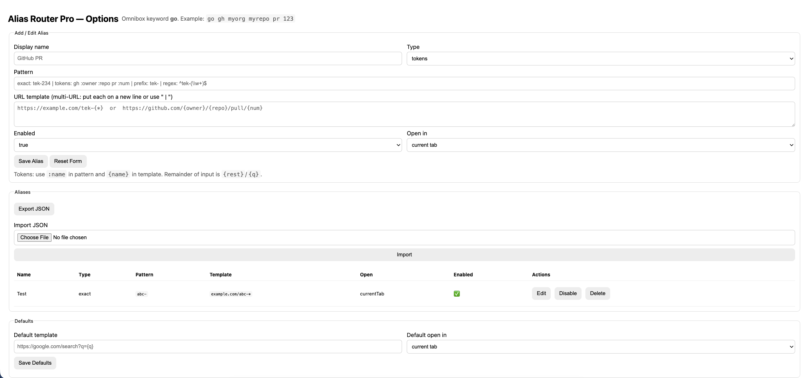

# Alias Router Pro — Omnibox Shortcuts for Chrome


**Alias Router Pro** is a minimal Chrome extension that lets you open any URL with short aliases.  
Type `go` + Space in the address bar, then your alias → instantly route to the right place.

---

## ✨ Features

- 🔑 **Omnibox keyword**: `go`
- 🎯 **Alias types**:
  - **Exact** → `docs` → `https://docs.example.com`
  - **Prefix** → `tek-234` → `https://example.com/tek-234`
  - **Tokens** → `gh :owner :repo pr :num` → `https://github.com/{owner}/{repo}/pull/{num}`
  - **Regex** → `^JIRA-(\d+)$` → `https://jira.example.com/browse/JIRA-$1`
- 📑 **Multi-URL templates** (open several tabs at once)
- 🖱️ **Right-click context menu** → “Open as alias”
- 🔄 **Import/Export JSON** for backup
- 🖥️ **Minimal popup UI** to add, edit, and delete aliases
- 🌐 Works offline, all settings stored locally with `chrome.storage.sync`

---

## 🖼️ Screenshots

| Popup | Options |
|-------|---------|
|  | 

---

## 🚀 Installation

### From Chrome Web Store (recommended)

👉 *(Link will go here after approval)*

### Manual (Developer mode)

1. Clone this repo
2. Go to `chrome://extensions` in Chrome.
3. Enable **Developer mode** (top-right).
4. Click **Load unpacked** and select the project folder.
5. Done! Type `go` + Space in the address bar to use aliases.

---

## 🛠️ Development

- Manifest V3
- Vanilla JavaScript + HTML + CSS
- Data stored in `chrome.storage.sync`

### Build

No build step required. Just zip the folder contents for publishing:

```bash
zip -r alias-router-pro.zip ./*
```

---

## 📄 Privacy

Alias Router Pro does not collect or share any personal data.  
Aliases and settings are stored locally using Chrome’s `chrome.storage.sync`.  
See [Privacy Policy](https://your-domain.com/privacy-policy.html) for details.

---

## 📨 Contact

Created by [Mohsen Fallahnejad](https://themohsen.me)  
📧 <support@themohsen.me>

---

## ⭐ Contribute

Pull requests welcome! If you have ideas for improvements, please open an issue or start a discussion.
